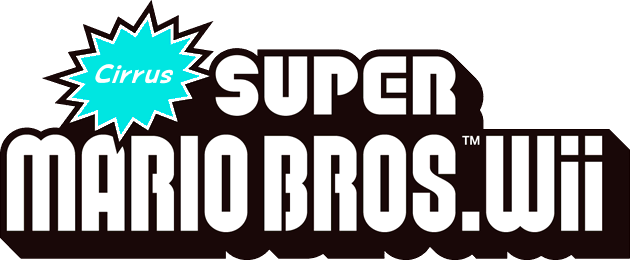

  
# Info
  ***Cirrus Super Mario Bros. Wii*** is a 1-world hack of New Super Mario Bros. Wii featuring sky themed levels. Bowser has taken over the skies of the Mushroom Kingdom, can Mario and friends stop Bowser and his actions?

## Features (planned as of January 23rd)
- 8 new levels with a variety of level themes, with 24 Star Coins to collect
- Retextured World Map
- In-Level Object Retextures
- Custom Tilesets
- Custom Music
- Various code patches from hacks such as Newer Super Mario Bros. Wii for features such as custom enemies
- …and more that you will eventually see!

## Development Videos
 
**Development Video #1** I changed the first word from Cloudy to Cirrus to make it stand out, will announce it in the next dev video)
<iframe width="560" height="315" src="https://www.youtube.com/embed/LjRiZnIgKRs" title="YouTube video player" frameborder="0" allow="accelerometer; autoplay; clipboard-write; encrypted-media; gyroscope; picture-in-picture" allowfullscreen></iframe>

**Development Video #2**
<iframe width="560" height="315" src="https://www.youtube.com/embed/l58S0nX8t38" title="YouTube video player" frameborder="0" allow="accelerometer; autoplay; clipboard-write; encrypted-media; gyroscope; picture-in-picture" allowfullscreen></iframe>

## Screenshots

## Trailers

**Trailer 1**
<iframe width="560" height="315" src="https://www.youtube.com/embed/RfkBsTj2pWE" title="YouTube video player" frameborder="0" allow="accelerometer; autoplay; clipboard-write; encrypted-media; gyroscope; picture-in-picture" allowfullscreen></iframe>

**Trailer 2**
<iframe width="560" height="315" src="https://www.youtube.com/embed/4WVexp2UpYg" title="YouTube video player" frameborder="0" allow="accelerometer; autoplay; clipboard-write; encrypted-media; gyroscope; picture-in-picture" allowfullscreen></iframe>

Check out these places for updates:
<iframe src="https://ptb.discord.com/widget?id=1000865896400703548&theme=dark" width="350" height="500" allowtransparency="true" frameborder="0" sandbox="allow-popups allow-popups-to-escape-sandbox allow-same-origin allow-scripts"></iframe> 
[GBATemp](https://gbatemp.net/threads/cirrus-super-mario-bros-wii.607234/) 
[NSMBHD](https://nsmbhd.net/thread/5772-cirrus-super-mario-bros-wii/)

